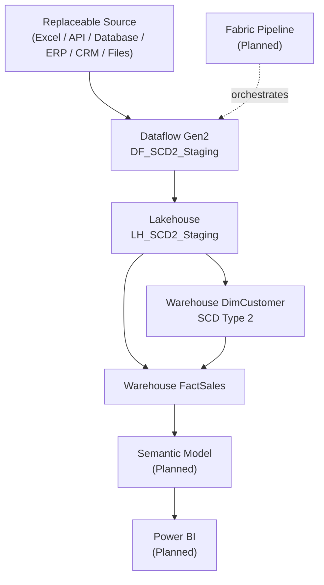

# Microsoft Fabric SCD Type 2 Customer History Pipeline

## Project Overview

This portfolio project implements and validates a Slowly Changing Dimension (SCD) Type 2 customer-history solution in Microsoft Fabric. It stages customer and sales data in a Lakehouse, preserves customer attribute history in a Warehouse dimension, and assigns each sales order to the customer version valid on its order date.

Excel is only the demonstration source. The downstream architecture is source-agnostic: equivalent data could come from REST APIs, SQL Server, Azure SQL, Oracle, PostgreSQL, MySQL, Snowflake, Databricks, SAP, Salesforce, SharePoint, CSV, Parquet, cloud storage, ERP systems, CRM systems, or other operational platforms. No downstream SQL changes are required while the `dbo.Customers` and `dbo.Sales` staging contracts remain consistent.

## Business Problem

Operational systems commonly overwrite customer attributes. That destroys the historical context required to determine which customer name, city, or classification applied when a transaction occurred. This solution retains prior customer versions while maintaining one current version and resolves facts against that history.

## Architecture

Dataflow Gen2 `DF_SCD2_Staging` loads the replaceable source into Lakehouse `LH_SCD2_Staging`. Warehouse `WH_SCD2` contains `dbo.DimCustomer`, `dbo.FactSales`, and `dbo.usp_LoadDimCustomer_SCD2`. Pipeline orchestration and reporting remain future phases.

## Technology Stack

- Microsoft Fabric workspace `WS_SCD2_Dev`
- Dataflow Gen2
- OneLake Lakehouse and its SQL analytics endpoint
- Fabric Warehouse and T-SQL
- Excel as demonstration input only
- Git and GitHub
- Power BI planned

## Repository Structure

```text
.
|-- data/
|   |-- source/                  # Demonstration workbook and source notes
|   `-- change-scenarios/        # Controlled SCD2 change inputs
|-- docs/                        # Architecture, environment, status, and evidence
|-- fabric/                      # Fabric artifact guidance
|-- power-bi/                    # Planned semantic-model and report assets
|-- sql/
|   `-- warehouse/               # Warehouse DDL, loads, migration, and validation
|-- AGENTS.md
|-- LICENSE
`-- README.md
```

## End-to-End Workflow

1. A replaceable operational source supplies customer and sales records.
2. `DF_SCD2_Staging` loads `dbo.Customers` and `dbo.Sales` into `LH_SCD2_Staging`.
3. The initial customer load creates the first known dimension versions.
4. `dbo.usp_LoadDimCustomer_SCD2` expires changed versions and inserts changed or new current versions.
5. The first known demo versions are backdated to inferred date `1900-01-01` so older facts have temporal coverage while their actual `CreatedDateTime` values remain unchanged.
6. The FactSales load resolves each order to exactly one customer version using inclusive-start and exclusive-end day-grain boundaries.
7. Read-only SQL verifies keys, mappings, totals, temporal attribution, reconciliation, and rerun behavior.

## Engineering Decisions

- Stable staging contracts decouple downstream SQL from the source platform.
- `Name` and `City` are tracked SCD2 attributes.
- `OrderNumber` is the FactSales grain and durable source identifier.
- Initial `1900-01-01` coverage is explicitly inferred rather than presented as authoritative history.
- Date-only sales use a documented day-grain temporal rule.
- Loads validate source and target integrity and are safely rerunnable for the tested snapshots.
- Surrogate keys use `MAX(...) + ROW_NUMBER()` and therefore require serialized execution.

## Implemented Components

| Component | Status |
|---|---|
| Dataflow Gen2 `DF_SCD2_Staging` | Implemented and verified |
| Lakehouse `LH_SCD2_Staging` | Implemented and verified |
| Lakehouse `dbo.Customers`, `dbo.Sales` | Implemented and verified |
| Warehouse `WH_SCD2` | Implemented and verified |
| `dbo.DimCustomer` | Implemented and verified |
| `dbo.usp_LoadDimCustomer_SCD2` | Implemented and verified |
| Initial temporal backfill | Implemented and verified |
| `dbo.FactSales` | Implemented and verified |
| Historical customer resolution | Implemented and verified |
| Dimension and fact rerun behavior | Implemented and verified |
| Fabric Pipeline | Planned |
| Semantic Model | Planned |
| Power BI Report | Planned |

## Validation Results

The SCD2 scenario preserved Ryan Taylor's historical Houston version, created his current Forney version, and inserted Charlie Taylor. An unchanged dimension rerun returned zero expired, changed-version, and new-customer rows.

The initial FactSales load returned three source rows, zero skipped rows, and three inserts. Its unchanged rerun returned three source rows, three skipped rows, and zero inserts. Validation found no unmatched facts, duplicate `SalesKey` values, or duplicate `OrderNumber` values. Source and Warehouse sales both totaled `900.00`, with a `0.00` difference. Order `1002` remained assigned to Ryan Taylor's historical Houston version (`CustomerID = 2`, `IsCurrent = 0`).

See [SCD Type 2 and FactSales test results](docs/scd2-test-results.md) for recorded evidence.

## Business Value

- Preserves customer history instead of overwriting it.
- Maintains historically correct sales attribution at the available day grain.
- Supports repeatable, idempotent manual ETL execution.
- Separates replaceable ingestion from stable dimensional processing.
- Provides auditable validation suitable for engineering review.

## Known Limitations

- `1900-01-01` is an inferred-history start, not proof that initial attributes were valid from that date.
- Source deletions are not implemented.
- Same-day customer changes and orders are ambiguous because `OrderDate` has no time component.
- Existing orders are treated as immutable by `OrderNumber`; changed source attributes for an already-loaded order are not updated.
- `MAX(...) + ROW_NUMBER()` surrogate-key generation assumes serialized execution.
- Fabric Pipeline orchestration, automated retry handling, and operational monitoring are not implemented.
- The small synthetic dataset does not demonstrate production scale or performance.

## Future Enhancements

- Build the Fabric Pipeline with dependencies, retry handling, and monitoring.
- Create the Semantic Model and Power BI report.
- Capture source event timestamps for precise same-day ordering.
- Define source-deletion and changed-order policies, including an Unknown-member strategy.
- Add broader data-quality, failure, null-transition, and scale tests.
- Capture portfolio screenshots and complete presentation polish.

## Architecture Diagram



## Git Workflow

FactSales work is maintained on branch `feature/fact-sales`. SQL and its validation evidence should be committed together so implementation decisions and verified outcomes remain traceable. This review does not commit, push, or merge changes.

## Lessons Learned

- Historical facts require dimension coverage before the earliest business event.
- Inferred history can make a demonstration coherent only when the assumption is visible.
- Date-only events support day-grain attribution, not exact same-day sequencing.
- Idempotency requires duplicate prevention and explicit rerun evidence.
- Stable staging contracts keep dimensional SQL independent of the originating platform.

## Resume Here

The Dataflow, Lakehouse, Warehouse dimension, SCD2 procedure, temporal backfill, FactSales load, and validation phases are complete and verified for the documented demo scenarios. Resume with Fabric Pipeline orchestration, followed by the Semantic Model, Power BI report, portfolio screenshots, and final portfolio polish. See [project status](docs/project-status.md) for the concise handoff.
