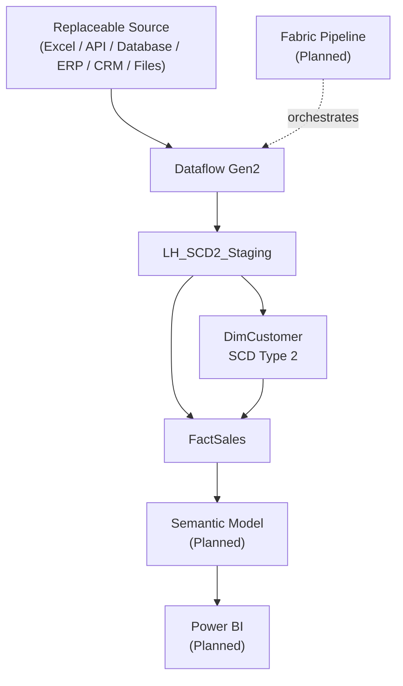

# Solution Architecture

## Current State

The solution is implemented and verified through `dbo.FactSales` in workspace `WS_SCD2_Dev`. Dataflow Gen2 `DF_SCD2_Staging` loads Lakehouse `LH_SCD2_Staging`; Warehouse `WH_SCD2` contains verified `dbo.DimCustomer`, `dbo.FactSales`, and `dbo.usp_LoadDimCustomer_SCD2` objects.

Excel is only the demonstration source. REST APIs, SQL Server, Azure SQL, Oracle, PostgreSQL, MySQL, Snowflake, Databricks, SAP, Salesforce, SharePoint, CSV, Parquet, cloud storage, ERP systems, and CRM systems can supply equivalent data without downstream SQL changes when the staging contract remains stable.

## Architecture

## Dimension Processing

`dbo.usp_LoadDimCustomer_SCD2` compares the current customer snapshot with current dimension rows. New customers receive a current version; tracked changes expire the prior version and create a replacement; unchanged customers are not duplicated. The verified scenario preserved Ryan Taylor's Houston history, made Forney current, and inserted Charlie Taylor.

The original versions begin at inferred date `1900-01-01` to cover historical orders while retaining their real creation audit timestamps. This is a documented demo assumption rather than authoritative history.

## Fact Processing

`dbo.FactSales` has one row per source sales order. `OrderNumber` is its durable source identifier and `CustomerKey` identifies the dimension version valid on `OrderDate`. The day-grain lookup uses an inclusive effective start and exclusive effective end. All orders on a new version's start date map to that new version; exact same-day sequencing requires an event timestamp.

The load validates source fields, source and target uniqueness, dimension integrity, and one-to-one temporal resolution before inserting. An unchanged rerun skips existing order numbers.

## Component Status

| Component | Status |
|---|---|
| Excel demonstration source | Available |
| `DF_SCD2_Staging` | Implemented and verified |
| `LH_SCD2_Staging.dbo.Customers` | Implemented and verified |
| `LH_SCD2_Staging.dbo.Sales` | Implemented and verified |
| `WH_SCD2.dbo.DimCustomer` | Implemented and verified |
| `dbo.usp_LoadDimCustomer_SCD2` | Implemented and verified |
| Initial temporal backfill | Implemented and verified |
| `WH_SCD2.dbo.FactSales` | Implemented and verified |
| Fabric Pipeline | Planned |
| Semantic Model | Planned |
| Power BI Report | Planned |

## Limitations and Next Steps

- The inferred `1900-01-01` start is not proof of historical validity.
- Source deletions are not handled.
- Date-only orders make same-day changes ambiguous.
- Existing facts are treated as immutable by `OrderNumber`; the current load does not update changed attributes for an order already loaded.
- Maximum-based surrogate-key generation requires serialized execution.
- Pipeline orchestration, semantic modeling, Power BI, screenshots, and portfolio polish remain.
