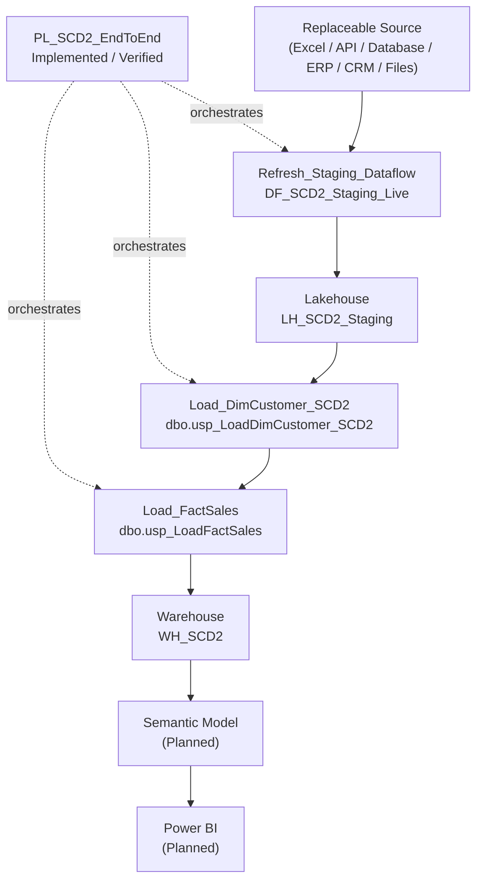

# Solution Architecture

## Current State

Pipeline `PL_SCD2_EndToEnd` is the implemented orchestration layer in workspace `WS_SCD2_Dev`. It controls staging refresh, dimension processing, and fact loading in strict success-dependent order.

Excel is only the demonstration source. APIs, relational databases, ERP systems, CRM systems, cloud storage, and other operational systems can supply equivalent data without downstream Warehouse changes when the staging contract remains stable.

## Architecture

## Orchestration Sequence

1. `Refresh_Staging_Dataflow` refreshes `DF_SCD2_Staging_Live`.
2. On success, `Load_DimCustomer_SCD2` calls `dbo.usp_LoadDimCustomer_SCD2` in `WH_SCD2`.
3. On success, `Load_FactSales` calls `dbo.usp_LoadFactSales` in `WH_SCD2`.

This ordering ensures customer versions exist before facts resolve their historical `CustomerKey` values.

## Dimension and Fact Processing

`CustomerID` remains the stable customer business key. New SCD2 versions receive distinct `CustomerKey` values, preserving changes such as Ryan Taylor's Houston-to-Forney-to-Plano history and Joey Taylor's Los Angeles-to-Annapolis history.

`dbo.FactSales` retains one row per `OrderNumber`. `dbo.usp_LoadFactSales` validates staging and target integrity, resolves the dimension version valid at day grain, and skips orders already loaded. Sales are verified through `OrderNumber = 1012`.

## Component Status

| Component | Status |
|---|---|
| `DF_SCD2_Staging_Live` | Implemented and verified |
| `LH_SCD2_Staging.dbo.Customers` | Implemented and verified |
| `LH_SCD2_Staging.dbo.Sales` | Implemented and verified |
| `WH_SCD2.dbo.DimCustomer` | Implemented and verified |
| `dbo.usp_LoadDimCustomer_SCD2` | Implemented and verified |
| `WH_SCD2.dbo.FactSales` | Implemented and verified |
| `dbo.usp_LoadFactSales` | Implemented and verified |
| `PL_SCD2_EndToEnd` | Implemented and verified |
| Automated validation activity | Planned |
| Semantic Model | Planned |
| Power BI Report | Planned |

## Limitations and Next Steps

- Automated post-load validation is not part of the pipeline yet.
- Monitoring, alerting, scheduling, retries, and operational audit storage require hardening.
- Date-only orders make same-day changes ambiguous.
- Maximum-based key generation requires serialized execution.
