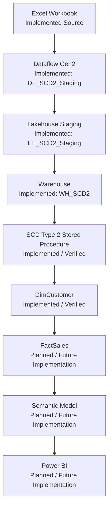

# Solution Architecture

## Current State

The current Microsoft Fabric SCD Type 2 flow is implemented and verified through `dbo.DimCustomer`. It includes `WS_SCD2_Dev`, Dataflow Gen2 `DF_SCD2_Staging`, Lakehouse `LH_SCD2_Staging`, its staging tables, Warehouse `WH_SCD2`, and stored procedure `dbo.usp_LoadDimCustomer_SCD2`. Downstream fact and reporting components remain planned.

## Implemented and Planned Architecture

The diagram distinguishes implemented components from proposed and future components.

The diagram communicates the verified flow through `DimCustomer` and the intended downstream flow. `FactSales`, the Semantic Model, and Power BI have not been implemented.

## From Source Changes to History

**Status: Implemented and Verified**

Source snapshots are staged and compared with current Customer Dimension records by customer business key:

1. A new customer will produce an initial current dimension record.
2. An existing customer whose tracked attributes have not changed will retain the current dimension record without creating another historical version.
3. An existing customer whose tracked attributes have changed will cause the prior current record to become historical and a new current record to be added.
4. Historical records will remain available so analysis can reconstruct the customer attributes that applied during an earlier period.

The initial load contained three current rows. In the verified scenario, Ryan Taylor's city changed from Houston to Forney and Charlie Taylor was added in Miami. The procedure expired one Ryan Taylor row, inserted one replacement version, inserted Charlie Taylor, and left Devon Johnson and Joey Taylor unchanged. An unchanged rerun produced zero changes. Source-delete handling remains outside the current scope.

## Why SCD Type 2 Fits Customer Attributes

**Status: Implemented; City Change Verified**

Attributes such as `Name` and `City` can change while the underlying customer remains the same. Overwriting those values would preserve only the latest state and remove the context needed to explain earlier business activity.

SCD Type 2 is appropriate because it retains separate dimension versions when tracked attributes change. The verified city-change scenario preserved Ryan Taylor's Houston history while making Forney current. `Name` and `City` are configured as tracked attributes; an additional name-change scenario remains planned.

## Component Status

| Component | Status |
|---|---|
| Excel Workbook source | Implemented / Available |
| Dataflow Gen2 `DF_SCD2_Staging` | Implemented |
| Fabric Data Pipeline | Planned / Future Implementation |
| Lakehouse `LH_SCD2_Staging` | Implemented |
| Lakehouse `dbo.Customers` and `dbo.Sales` | Implemented / Current snapshot loaded |
| Warehouse `WH_SCD2` | Implemented |
| `dbo.usp_LoadDimCustomer_SCD2` | Implemented / Verified |
| `dbo.DimCustomer` | Implemented / Verified |
| Initial `dbo.DimCustomer` load | Implemented / Verified with three current rows |
| `FactSales` | Planned / Future Implementation |
| Semantic Model | Planned / Future Implementation |
| Power BI Report | Planned / Future Implementation |

## Planned Extensions and Limitations

- `FactSales` and its relationship to `DimCustomer` remain planned.
- Microsoft Fabric Data Pipeline orchestration remains planned.
- Source deletions are not handled by the current procedure.
- `MAX(CustomerKey)` key generation requires serialized executions.
- Additional change scenarios, Power BI, and production hardening remain planned.
